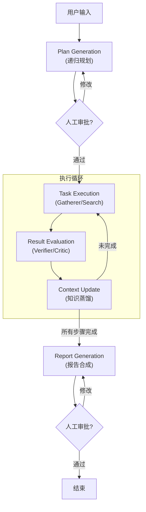
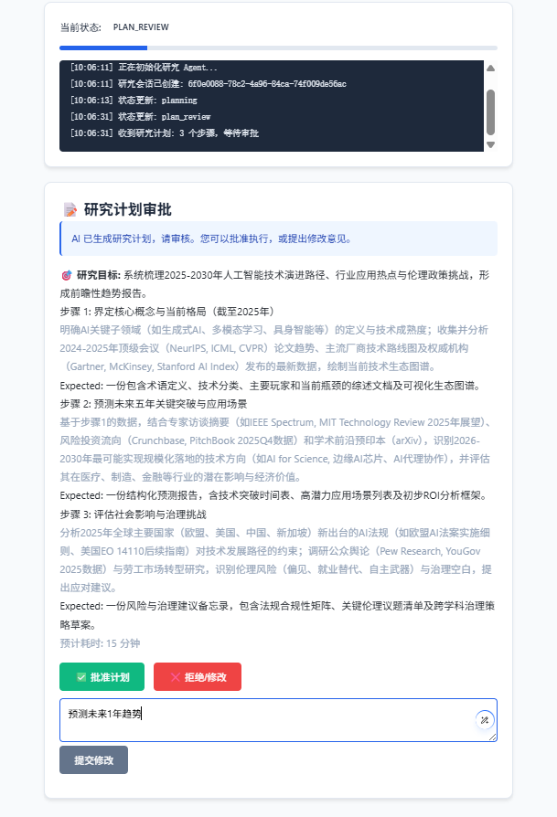
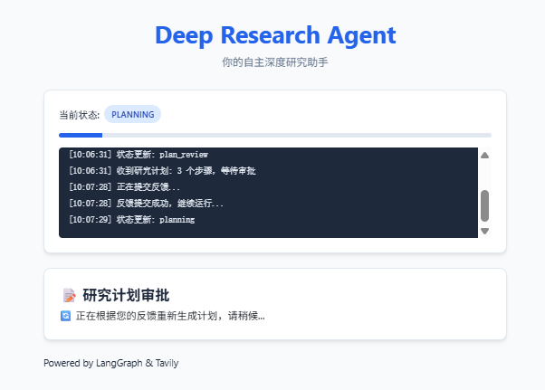
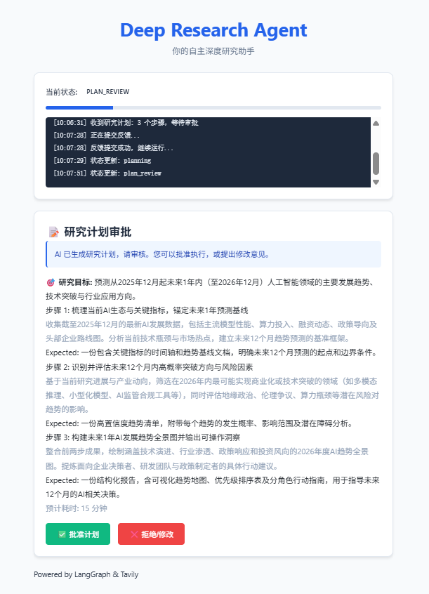
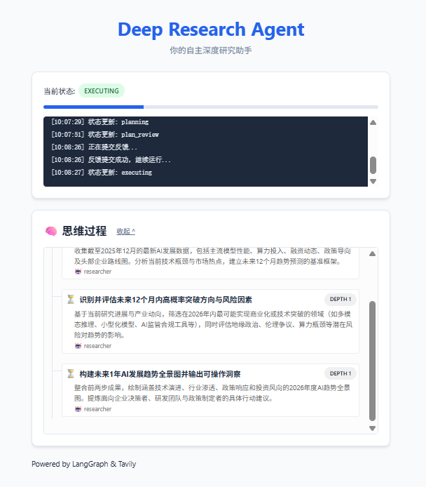
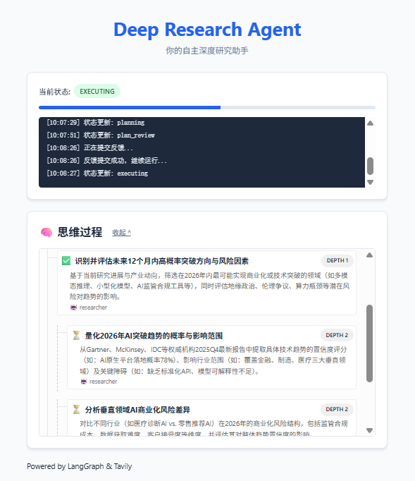
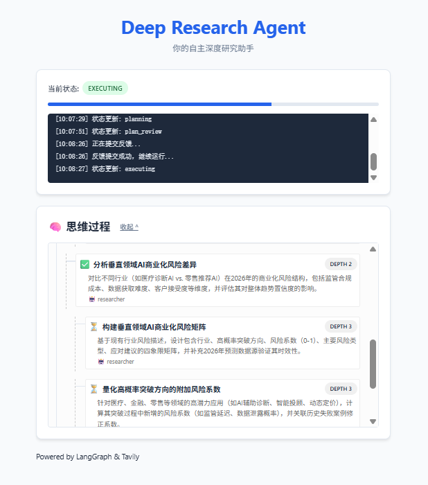
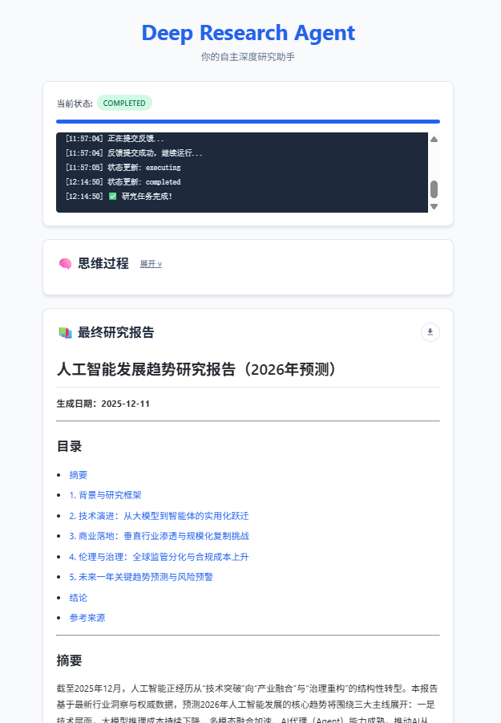
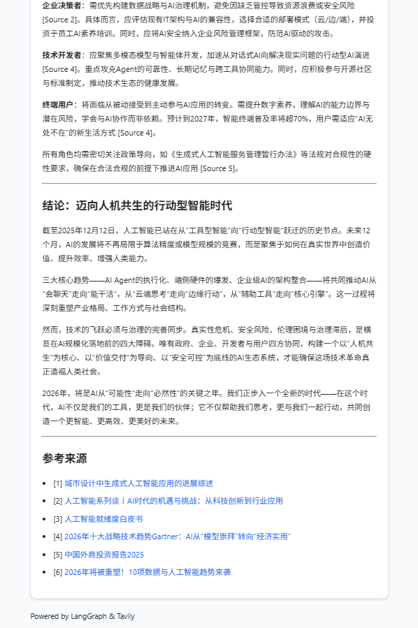

# Deep Research Agent (FractalMind Reference Implementation)

> 🤖 基于 **FractalMind 架构** 与 **AgentCore 框架** 构建的下一代自主研究智能体。

Deep Research Agent 是 FractalMind 架构的首个参考实现（Reference Implementation）。它不仅仅是一个搜索工具，更展示了如何利用**分形编排（Fractal Orchestration）**、**自适应上下文管理**以及**协议化互操作（MCP）**来解决具有高模糊性的深度研究任务。

它能够接收复杂的用户意图，通过递归规划将其拆解为可执行的子任务，并行调度 "Gatherer"（信息采集）与 "Verifier"（质量验证）角色，最终合成一份结构化、有深度且来源可溯的研究报告。

## 🌟 核心特性 (Core Features)

### 1. 分形认知编排 (Fractal Cognitive Orchestration)
区别于线性的 Chain-of-Thought，本系统采用动态图（Dynamic Graph）架构：
*   **递归规划 (Recursive Planning)**: 能够将宏大的研究主题（如"分析2025年AI硬件趋势"）自动拆解为多层级的子问题树。
*   **动态修正 (Self-Correction)**: 在执行过程中，根据搜索到的新信息实时调整后续的研究路径。

### 2. 自适应上下文管理 (Adaptive Context Management)
解决大模型 "Lost-in-the-Middle" 现象：
*   **知识蒸馏**: 自动将冗长的搜索结果压缩为高密度的 "Knowledge Nuggets"。
*   **动态加载**: 基于语义相似度（Embedding）在推理时仅加载最相关的上下文片段，实现“显存即缓存”。

### 3. 企业级可观测性与治理
*   **全链路追踪**: 集成 **Langfuse**，提供从用户 Query 到底层 Tool Call 的完整执行轨迹透视。
*   **递归熔断器 (Circuit Breaker)**: 内置深度限制与循环检测，防止 Agent 陷入死循环，保护 Token 预算。

### 4. Human-in-the-Loop (HITL)
*   **交互式审批**: 支持在“计划生成”与“报告发布”阶段引入人工反馈，用户可以修正研究方向或直接编辑生成的计划。

## 🏗️ 架构概览

系统基于 `libs/agent-core` 构建，遵循 **P-E-E (Plan-Execute-Evaluate)** 范式：



## � 运行演示 (Demo)

### 📸 界面截图

| 初始化与计划 | HITL 审批 |
| :---: | :---: |
|  |  |

| 计划修改 | 再次审批 |
| :---: | :---: |
|  |  |

**分形编排与动态调整 (Fractal Orchestration & Dynamic Adjustment):**

| 递归思维树 | 动态路径调整 1 | 动态路径调整 2 |
| :---: | :---: | :---: |
|  |  |  |

**结果生成:**

| 执行完成 | 最终报告 |
| :---: | :---: |
|  |  |

### 🔍 全链路追踪 (Trace)

查看完整的执行链路与思维过程：
[Langfuse Trace Example](https://cloud.langfuse.com/project/cmhkk7puw01cnad08uwnxugs9/traces/021e01db861064be84a57d63ec62092d?observation=764a59ea2ec86ad2&timestamp=2025-12-12T02:06:11.283Z)

## �🚀 快速开始 (Quick Start)

### 1. 环境准备
*   Python 3.10+
*   [Tavily API Key](https://tavily.com/) (用于搜索)
*   [OpenAI API Key](https://platform.openai.com/) (或其他兼容 LLM)
*   (可选) [Langfuse Keys](https://langfuse.com/) (用于追踪)

### 2. 安装依赖

```bash
cd agents/deep-research
pip install -r requirements.txt
```

### 3. 配置环境变量

复制 `.env.example` (如果存在) 或新建 `.env` 文件：

```ini
# LLM Configuration
OPENAI_API_KEY=sk-...
OPENAI_MODEL_NAME=gpt-4o

# Search Configuration
TAVILY_API_KEY=tvly-...

# Observability (Optional but Recommended)
LANGFUSE_PUBLIC_KEY=pk-lf-...
LANGFUSE_SECRET_KEY=sk-lf-...
LANGFUSE_HOST=https://cloud.langfuse.com
```

### 4. 运行服务

我们提供了便捷的启动脚本，会自动设置 `PYTHONPATH` 并激活虚拟环境（如果存在）：

**Windows:**
```bat
run_server.bat
```

**Linux/Mac:**
```bash
# 确保在项目根目录下安装了 agent-core
export PYTHONPATH=$PYTHONPATH:$(pwd)/src:$(pwd)/../../libs/agent-core/src
python -m deep_research_agent.app
```

服务启动后，API 将默认监听在 `http://localhost:8000`。

## 📂 项目结构

```text
deep-research/
├── src/
│   └── deep_research_agent/
│       ├── graph.py            # LangGraph 状态机定义 (FractalGraphBuilder)
│       ├── state.py            # 状态模型 (Pydantic)
│       ├── nodes/              # 核心节点实现
│       │   ├── plan_generation.py
│       │   ├── search_execution.py
│       │   └── report_generation.py
│       └── middleware/         # 业务特定中间件
├── html/                       # 前端测试界面
├── run_server.bat              # 启动脚本
└── requirements.txt            # 依赖列表
```

## 🧪 测试与验证

项目包含完整的单元测试与集成测试：

```bash
# 运行所有测试
pytest test/
```

---
*Powered by FractalMind Architecture*
