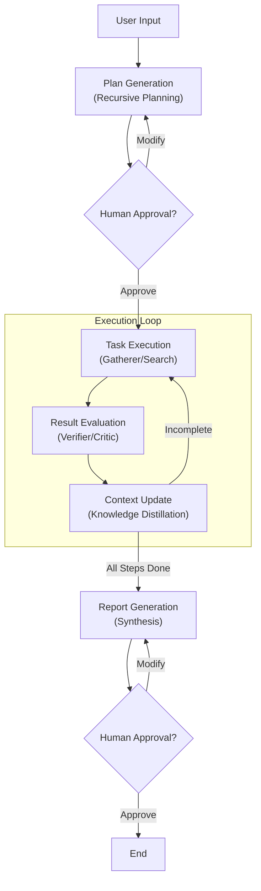

# Deep Research Agent (FractalMind Reference Implementation)

> 🤖 Next-generation autonomous research agent built on **FractalMind Architecture** and **AgentCore Framework**.

The Deep Research Agent is the first reference implementation of the FractalMind architecture. It is not just a search tool, but a demonstration of how to use **Fractal Orchestration**, **Adaptive Context Management**, and **Protocol-Agnostic Interoperability (MCP)** to solve deep research tasks with high ambiguity.

It accepts complex user intentions, recursively decomposes them into executable sub-task trees via planning, parallelly schedules "Gatherer" (Information Collection) and "Verifier" (Quality Verification) roles, and finally synthesizes a structured, in-depth, and traceable research report.

## 🌟 Core Features

### 1. Fractal Cognitive Orchestration
Unlike linear Chain-of-Thought, this system employs a Dynamic Graph architecture:
*   **Recursive Planning**: Automatically decomposes grand research topics (e.g., "Analyze AI Hardware Trends in 2025") into multi-level sub-problem trees.
*   **Self-Correction**: Real-time adjustment of subsequent research paths based on new information found during execution.

### 2. Adaptive Context Management
Solves the "Lost-in-the-Middle" phenomenon of Large Language Models:
*   **Knowledge Distillation**: Automatically compresses lengthy search results into high-density "Knowledge Nuggets".
*   **Dynamic Loading**: Loads only the most relevant context fragments based on semantic similarity (Embedding) during inference, achieving "VRAM as Cache".

### 3. Enterprise Observability & Governance
*   **Full-Link Tracing**: Integrated with **Langfuse** to provide complete execution trajectory visibility from User Query to underlying Tool Calls.
*   **Recursion Circuit Breaker**: Built-in depth limits and loop detection to prevent the Agent from falling into infinite loops and protecting Token budgets.

### 4. Human-in-the-Loop (HITL)
*   **Interactive Approval**: Supports introducing human feedback during the "Plan Generation" and "Report Publication" phases, allowing users to correct research directions or directly edit generated plans.

## 🏗️ Architecture Overview

The system is built on `libs/agent-core` and follows the **P-E-E (Plan-Execute-Evaluate)** paradigm:



## � Demo

### 📸 Screenshots

| Initialization | HITL Approval |
| :---: | :---: |
|  |  |

| Plan Modification | Re-Approval |
| :---: | :---: |
|  |  |

**Fractal Orchestration & Dynamic Adjustment:**

| Recursive Thought Tree | Dynamic Path Adjustment 1 | Dynamic Path Adjustment 2 |
| :---: | :---: | :---: |
|  |  |  |

**Results:**

| Execution Completed | Final Report |
| :---: | :---: |
|  |  |

### 🔍 Full Trace

View the complete execution trace and thought process:
[Langfuse Trace Example](https://cloud.langfuse.com/project/cmhkk7puw01cnad08uwnxugs9/traces/021e01db861064be84a57d63ec62092d?observation=764a59ea2ec86ad2&timestamp=2025-12-12T02:06:11.283Z)

## �🚀 Quick Start

### 1. Prerequisites
*   Python 3.10+
*   [Tavily API Key](https://tavily.com/) (for search)
*   [OpenAI API Key](https://platform.openai.com/) (or other compatible LLMs)
*   (Optional) [Langfuse Keys](https://langfuse.com/) (for tracing)

### 2. Install Dependencies

```bash
cd agents/deep-research
pip install -r requirements.txt
```

### 3. Configure Environment Variables

Copy `.env.example` (if exists) or create a `.env` file:

```ini
# LLM Configuration
OPENAI_API_KEY=sk-...
OPENAI_MODEL_NAME=gpt-4o

# Search Configuration
TAVILY_API_KEY=tvly-...

# Observability (Optional but Recommended)
LANGFUSE_PUBLIC_KEY=pk-lf-...
LANGFUSE_SECRET_KEY=sk-lf-...
LANGFUSE_HOST=https://cloud.langfuse.com
```

### 4. Run Server

We provide a convenient startup script that automatically sets `PYTHONPATH` and activates the virtual environment (if it exists):

**Windows:**
```bat
run_server.bat
```

**Linux/Mac:**
```bash
# Ensure agent-core is installed or in PYTHONPATH
export PYTHONPATH=$PYTHONPATH:$(pwd)/src:$(pwd)/../../libs/agent-core/src
python -m deep_research_agent.app
```

Once started, the API will listen on `http://localhost:8000` by default.

## 📂 Project Structure

```text
deep-research/
├── src/
│   └── deep_research_agent/
│       ├── graph.py            # LangGraph State Machine (FractalGraphBuilder)
│       ├── state.py            # State Model (Pydantic)
│       ├── nodes/              # Core Node Implementations
│       │   ├── plan_generation.py
│       │   ├── search_execution.py
│       │   └── report_generation.py
│       └── middleware/         # Domain Specific Middleware
├── html/                       # Frontend Test UI
├── run_server.bat              # Startup Script
└── requirements.txt            # Dependencies
```

## 🧪 Testing

The project includes comprehensive unit and integration tests:

```bash
# Run all tests
pytest test/
```

---
*Powered by FractalMind Architecture*
