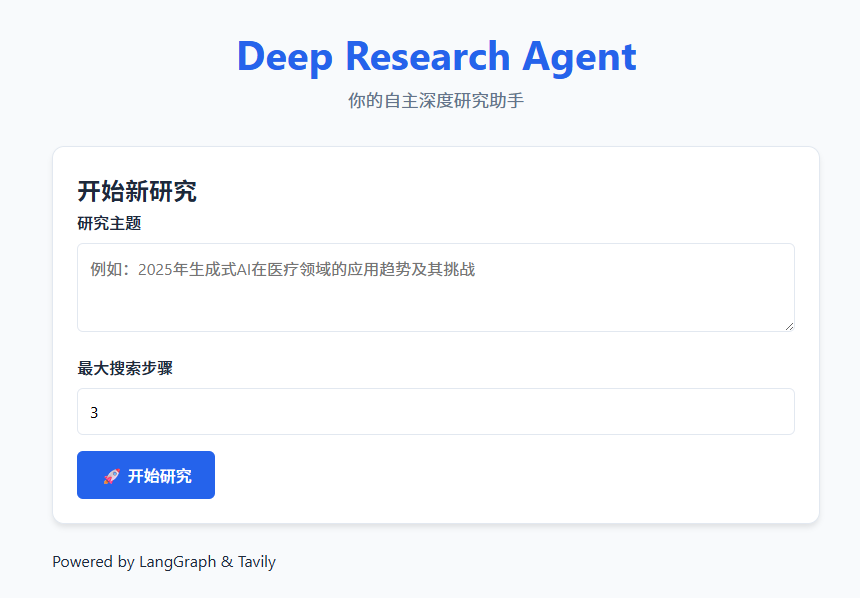
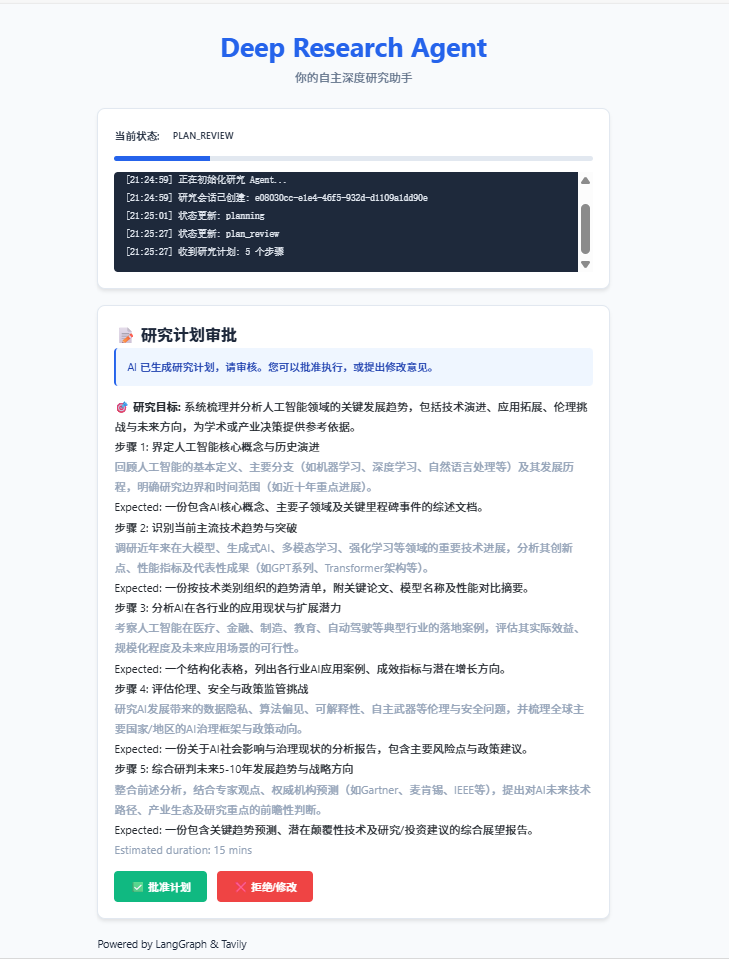
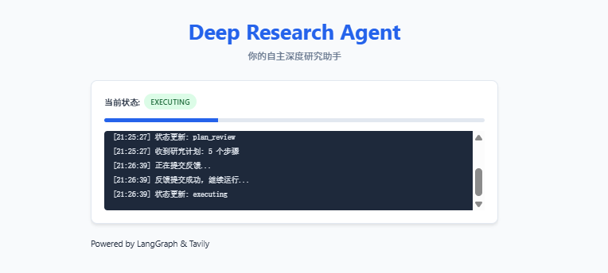

# Deep Research Agent

> 🤖 An autonomous research agent implementation built on **AgentCore Framework**.

The Deep Research Agent is a reference implementation of this framework. It is capable of autonomously formulating research plans, executing multi-step web searches, extracting key information, and ultimately generating structured deep research reports based on complex topics provided by users.

## 💡 Key Features

*   **🧠 Autonomous Planning**: Utilizes LLM to break down vague research goals into executable specific search steps.
*   **🕸️ Deep Search**: Integrates Tavily API to perform precise searches and content scraping for each step.
*   **🔍 Intelligent Extraction**: Automatically analyzes and extracts key data, facts, and citations from search results.
*   **🤝 Human-in-the-Loop**: Integrates the framework's HITL mechanism, allowing users to review and modify plans via the Web UI.
*   **📄 Report Generation**: Automatically synthesizes all insights into a comprehensive Markdown/PDF report.

## 👀 Demo

### 💻 Web Interface

The Deep Research Agent provides an intuitive Web interface (built via `Dockerfile.frontend` in the root):

*   **⚙️ Configuration**: Customize research topics and max search steps.
*   **📝 Plan Approval**: Review, modify, or approve plans before execution.
*   **📊 Real-time Progress**: View the agent's current status and execution logs in real-time.

### 📸 Screenshots

| Initialization | Plan Approval (HITL) |
| :---: | :---: |
|  |  |

| Execution | Report Completed |
| :---: | :---: |
|  |  |

## 🚀 Quick Start

### Prerequisites

Ensure you have installed the core library `agent-core` (refer to the root README).

### Install Dependencies

```bash
cd agents/deep-research
pip install -r requirements.txt
```

### Configuration

Create a `.env` file in the `agents/deep-research/` directory:

```ini
OPENAI_API_KEY=sk-...
TAVILY_API_KEY=tvly-...
# Optional: Langfuse for tracing
LANGFUSE_PUBLIC_KEY=...
```

### Running

```bash
# Ensure PYTHONPATH is set in the root, or run locally:
export PYTHONPATH=$PYTHONPATH:$(pwd)/src
python -m deep_research_agent.app
```

### View Trace

See the full execution trace example: [Langfuse Trace Example](https://cloud.langfuse.com/project/cmhkk7puw01cnad08uwnxugs9/traces/15f6ba4c96f0d22baa439c858342349b?observation=53db5328b8a22151&timestamp=2025-11-22T08:54:01.003Z).
