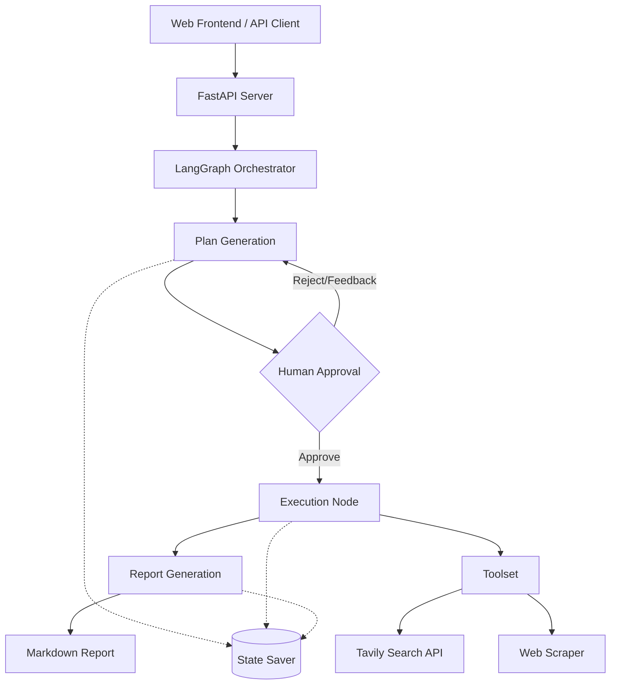

# AgentCore 架构设计文档

## 1. 系统概览

本项目采用分层架构，由底层的通用框架 **AgentCore** 和上层的具体应用实现（如 **Deep Research Agent**）组成。

*   **AgentCore Framework**: 提供构建可控、可观测智能体所需的基础设施。
*   **Deep Research Agent**: 基于 AgentCore 构建的参考实现，专注于自主信息检索和报告生成。

## 2. 核心架构

系统遵循模块化、解耦的设计原则，并采用 Monorepo 结构来管理核心框架与具体应用。

### 2.1 代码组织 (Code Organization)

系统分为两大部分：

1.  **Framework Core (`libs/agent-core`)**:
    *   通用的 Agent 基础设施，与具体业务无关。
    *   包含：Graph 状态机基类、中间件框架、Tool 接口、配置管理系统等。
2.  **Agent Implementation (`agents/deep-research`)**:
    *   具体的业务逻辑实现。
    *   依赖于 `agent-core`，定义了具体的 Research Plan、Prompt Templates 和 Workflow Graph。

### 2.2 系统分层

主要包含以下几层：

### 2.1 架构组件

1.  **Frontend (UI Layer)**:
    *   基于 HTML5/JS (ES6+) 的单页应用。
    *   负责用户交互、状态轮询、Markdown 渲染及 PDF 导出。
    *   通过 REST API 与后端通信。

2.  **API Gateway (App Layer)**:
    *   基于 **FastAPI** 构建。
    *   提供异步接口：启动任务、查询状态、提交反馈。
    *   管理 Agent 的生命周期和会话状态。

3.  **Agent Core (Logic & Framework Layer)**:
    *   基于 `libs/agent-core` 提供的基础能力，构建特定业务的 **LangGraph** 状态机。
    *   **Nodes**:
        *   `plan_node`: 负责理解用户意图，生成研究步骤。
        *   `research_node`: 循环执行，负责针对每个步骤进行搜索、网页抓取和信息提取。
        *   `report_node`: 汇总所有收集的信息，生成最终报告。
        *   `human_review_node`: (逻辑集成在图的边缘) 处理人工反馈。
    *   **State Management**: 使用 LangGraph `StateGraph` 维护全局状态（包含原始 Query、当前 Plan、已收集 insights、生成过程中的中间结果）。

4.  **Infrastructure (Data & Tool Layer)**:
    *   **LLM Integration**: 通过 LangChain 抽象，支持 OpenAI (GPT-4o) 等模型。
    *   **Search Engine**: 集成 Tavily API 专为 LLM 优化的搜索引擎。
    *   **Persistence**: 使用 SQLite (`AsyncSqliteSaver`) 持久化会话状态，支持断点续传和历史回溯。

## 3. 详细设计

### 3.1 状态机定义 (State Graph)

系统状态 `AgentState` 包含：
*   `query`: 用户输入的主题。
*   `research_plan`: 当前的研究计划（包含步骤列表）。
*   `extracted_insights`: 结构化的信息片段集合。
*   `sources`: 引用来源列表。
*   `final_report`: 生成的 Markdown 报告。
*   `messages`: 消息历史（用于调试和上下文）。

### 3.2 工作流逻辑

1.  **Planning Phase**:
    *   输入：User Query + Configuration。
    *   操作：LLM 分析 Query，生成 JSON 格式的 `ResearchPlan`。
    *   输出：更新 State 中的 `research_plan`。

2.  **Human Review Phase (Interrupt)**:
    *   LangGraph 设置断点 (`interrupt_before=["research_node"]`)。
    *   系统暂停，等待 API `/feedback` 调用。
    *   如果用户 Approve -> 继续执行。
    *   如果用户 Feedback -> 回退到 Planning Phase 重新生成。

3.  **Execution Phase (Loop)**:
    *   遍历 `research_plan.steps`。
    *   对每个步骤生成具体的搜索词 (Search Queries)。
    *   并行执行搜索 (Tavily)。
    *   LLM 阅读搜索结果，提取关键 Insight 并附带引用 (Citations)。
    *   累积到 `extracted_insights`。

4.  **Reporting Phase**:
    *   输入：所有 `extracted_insights`。
    *   操作：LLM 综合整合，按逻辑结构撰写长文报告。
    *   操作：生成目录 (TOC) 和参考文献 (References)。
    *   输出：更新 `final_report`。

## 4. 技术选型

| 组件 | 选型 | 理由 |
| :--- | :--- | :--- |
| **语言** | Python 3.10+ | AI 生态最成熟，强类型提示支持 (Pydantic)。 |
| **Web 框架** | FastAPI | 高性能异步支持，自动生成 OpenAPI 文档。 |
| **Agent 框架** | LangGraph | 提供精确的图控制、循环能力和内置的持久化/Human-in-the-loop 支持。 |
| **LLM 编排** | LangChain | 统一的模型接口，丰富的工具链。 |
| **Model** | qwen3-max / GPT-4o / 4o-mini | 强大的推理和长文本处理能力。 |
| **Search** | Tavily | 专为 Agent 设计，返回干净的文本而非混乱的 HTML。 |
| **Frontend** | Vanilla JS + Bootstrap | 轻量级，无构建步骤，易于部署和演示。 |

## 5. 可扩展性设计

*   **Middleware 模式**: 可以在 Graph 中插入 Middleware 节点（如 Token 计数、安全过滤器）。
*   **Tool 抽象**: 搜索工具被封装，未来可轻松替换为 Google Search 或 Bing Search。
*   **Model Agnostic**: 通过 LangChain，只需修改环境变量即可切换到底层 LLM (如 Claude 3, Llama 3)。
*   **Docker Ready**: 项目结构标准，易于容器化部署。

## 6. 错误处理与监控

*   **重试机制**: LLM 调用和网络请求均配置了指数退避重试。
*   **结构化日志**: 关键路径均有 Log 记录，Frontend 实时展示后端状态。
*   **Graceful Degradation**: 搜索失败时会尝试使用备选 Query 或跳过非关键步骤。
