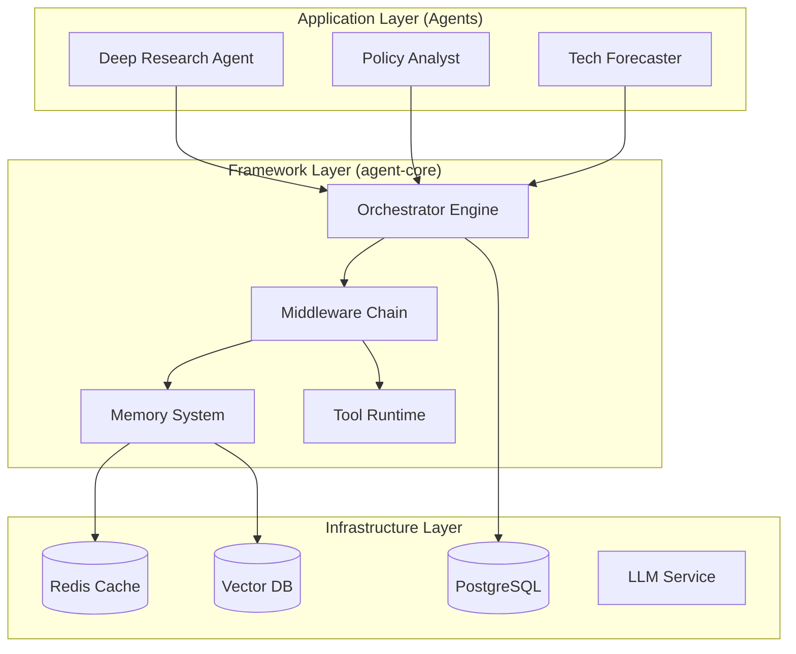

# 001 - Changflow Multi-Agent Framework Vision

**Status:** Draft
**Date:** 2025-12-03
**Author:** Changflow Team

## 1. 愿景 (Vision)

Changflow 旨在构建一个**生产级、可观测、确定性**的多智能体协同框架。

目前的 `deep-research-agent` 验证了基于 LangGraph + HITL (Human-in-the-Loop) 能够解决复杂的深度研究任务。我们的愿景是将这一成功经验泛化，打造一个通用的 Agent 操作系统，使得开发者能够：

*   **快速构建**: 基于标准化的 `agent-core` 库，像搭积木一样组装垂直领域的智能体。
*   **确定性编排**: 通过严格的状态管理和编排引擎（Orchestrator），让 Agent 的行为可预测、可调试、可回溯。
*   **企业级治理**: 内置 Token 预算控制、权限策略（OPA）、安全沙箱（WASI）和全链路可观测性。

最终目标是从单一的 "Deep Research Agent" 演进为 "Changflow Ecosystem"，支撑从个人助手到企业级多智能体集群的各种应用场景。

## 2. 目标架构 (Target Architecture)

我们将采用 Monorepo（单体仓库）结构来管理核心框架与上层应用，通过清晰的分层实现高内聚低耦合。



### 2.1 核心层 (libs/agent-core)
这是框架的基石，以 Python 包的形式独立发布，包含：

*   **Orchestration**: 基于 LangGraph 的通用图编排封装，提供标准的 `BaseNode` 和 `BaseState`。
*   **Memory**: 统一的记忆接口，支持 Short-term (Redis) 和 Long-term (Vector DB) 记忆，内置 RAG 策略。
*   **Middleware**: 可插拔的中间件系统，用于处理日志、鉴权、Tracing (Langfuse)、Budget Control 等。
*   **Runtime**: 安全的工具执行环境（计划引入 WASI 用于 Python 代码沙箱执行）。

### 2.2 应用层 (agents/*)
基于 `agent-core` 构建的垂直领域智能体：

*   **deep-research**: 也就是目前的 Deep Research Agent，作为框架的参考实现。
*   **...**: 未来扩展的其他垂类 Agent。

## 3. 核心特性演进 (Key Features Roadmap)

我们将参考 Shannon 项目的优秀实践，逐步引入以下关键能力：

### Phase 1: 核心拆分 (Refactoring)
*   [ ] **Monorepo 迁移**: 建立 `libs/agent-core` 和 `agents/deep-research` 目录结构。
*   [ ] **Core 抽取**: 将 `deep_research_agent.core` 和 `middleware` 移动到公共库。
*   [ ] **统一配置**: 建立全局的 `config/models.yaml` 来统一管理模型定价和参数。

### Phase 2: 企业级增强 (Governance)
*   [ ] **Budget Control**: 引入 Token 预算管理，防止 Agent 消耗失控。
*   [ ] **Policy Engine**: 集成 OPA (Open Policy Agent) 或类似机制，控制 Agent 对工具和数据的访问权限。
*   [ ] **Sandboxed Execution**: 对于代码执行类工具，引入 Docker 或 WASI 沙箱隔离。

### Phase 3: 多智能体协同 (Collaboration)
*   [ ] **Supervisor Pattern**: 实现 Supervisor 节点，支持任务分发和多 Agent 协作。
*   [ ] **Communication Protocol**: 定义 Agent 间的标准通信协议（消息格式、握手流程）。

## 4. 迁移策略 (Migration Strategy)

为了保证业务连续性，我们采取**就地重构 (In-place Refactoring)** 策略：

1.  **保持现状**: `deep-research-agent` 仓库保持不变，暂不创建新 Repo。
2.  **内部调整**: 在现有 Repo 内新建 `libs` 和 `agents` 目录。
3.  **逐步搬迁**:
    *   Step 1: 将现有业务代码挪入 `agents/deep-research`。
    *   Step 2: 识别通用代码，下沉至 `libs/agent-core`。
    *   Step 3: 修改 `agents/deep-research` 的引用指向 `libs/agent-core`。
4.  **改名发布**: 当结构稳定后，将 GitHub 仓库重命名为 `changflow-framework` (暂定)。

## 5. 目录结构预览

```text
changflow-root/
├── libs/
│   └── agent-core/       # 核心框架
├── agents/
│   ├── deep-research/    # 现有业务
│   └── examples/         # 最小示例
├── deploy/               # 统一的 docker-compose
├── docs/                 # 全局文档
└── tools/                # 开发脚本
```

---
此文档将随着项目的演进持续更新。
