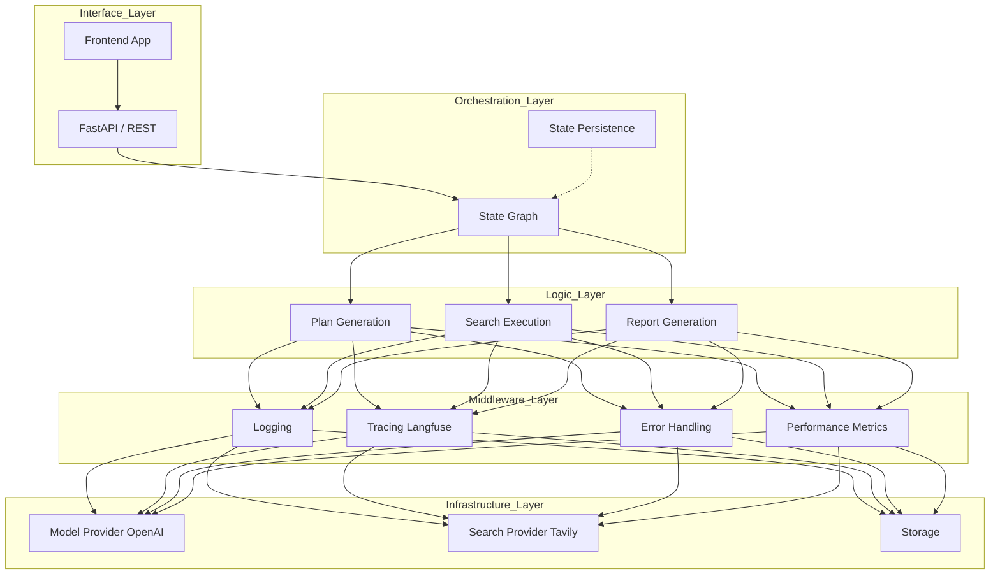

# Deep Research Agent 设计文档

## 1. 项目概述

Deep Research Agent 是一个基于 Large Language Models (LLM) 和 LangGraph 的自主智能体，旨在自动化复杂的在线研究任务。该系统能够接收用户的研究主题，自动拆解任务，执行多步骤的网络搜索与信息提取，最终生成全面、结构化的研究报告。

本项目不仅仅是一个功能实现，更是一个展示生产级 Agent 架构设计的参考范例，包含严格的类型定义、中间件机制、Human-in-the-Loop (HITL) 流程以及完善的可观测性集成。

## 2. 核心架构设计

### 2.1 技术选型

*   **Runtime / Orchestration**: [LangGraph](https://github.com/langchain-ai/langgraph)
    *   *理由*: 提供有向无环图 (DAG) 和 循环图 (Cyclic Graph) 的编排能力，原生支持状态持久化和 HITL。
*   **LLM Framework**: [LangChain](https://github.com/langchain-ai/langchain)
    *   *理由*: 丰富的模型接口和工具生态。
*   **Observation / Tracing**: [Langfuse](https://langfuse.com/)
    *   *理由*: 开源、易用的 LLM 追踪和评估平台。
*   **Search Engine**: [Tavily API](https://tavily.com/)
    *   *理由*: 专为 AI Agent 设计的搜索引擎，返回结果更适合 LLM 处理。
*   **API / Serving**: [FastAPI](https://fastapi.tiangolo.com/)
    *   *理由*: 高性能、异步支持、自动生成文档。
*   **Database (Optional)**: PostgreSQL + Redis
    *   *理由*: 持久化状态和缓存（本项目使用 LangGraph 的 MemorySaver 作为 MVP 实现）。

### 2.2 系统分层架构

## 3. 详细模块设计

### 3.1 状态模型 (State Model)

系统状态是 Agent 的核心，定义在 `ResearchAgentState` 中，基于 Pydantic 验证。

*   **`user_query`**: 用户原始输入。
*   **`research_plan`**: 结构化的研究计划 (包含多个 `ResearchStep`)。
*   **`extracted_insights`**: 从搜索结果中提取的关键洞察，按步骤 ID 索引。
*   **`status`**: Agent 当前状态 (PLANNING, EXECUTING, REVIEW, etc.)。
*   **`metadata`**: 用于存储中间件产生的指标、日志上下文等元数据。
*   **`trace_id`**: 分布式追踪 ID。

### 3.2 中间件系统 (Middleware System)

为了解耦业务逻辑与非功能性需求（如日志、监控），我们设计了一套面向切面（AOP）的中间件系统。

*   **设计模式**: 装饰器模式 + 责任链模式。
*   **机制**: 每个 Graph Node 被 `MiddlewareManager` 包装。
*   **生命周期钩子**:
    *   `before_node_execution`: 节点执行前触发 (如：开始计时、创建 Trace Span)。
    *   `after_node_execution`: 节点成功后触发 (如：记录性能、更新 Trace)。
    *   `on_error`: 节点抛出异常时触发 (如：错误分类、重试策略)。

### 3.3 Human-in-the-Loop (HITL) 机制

HITL 允许人工在关键决策点介入，本项目实现了两种模式：

1.  **Plan Approval (计划审批)**:
    *   在生成研究计划后暂停。
    *   用户可以：批准 (Approve)、修改 (Modify) 或 拒绝 (Reject)。
    *   实现：LangGraph `interrupt_before` + 状态路由。

2.  **Final Report Review (报告审核)**:
    *   在生成最终报告后暂停。
    *   用户可以在发布前检查内容准确性。

### 3.4 具体节点逻辑

#### A. Plan Generation (计划生成)
*   **Input**: `user_query`
*   **Model**: GPT-4 or similar.
*   **Output**: JSON 格式的计划，包含 3-5 个搜索步骤，每个步骤包含特定关键词和预期结果。

#### B. Search Execution (搜索执行)
*   **Process**:
    1.  获取 `status=PENDING` 的当前步骤。
    2.  生成搜索查询 (State Query + Step Keywords)。
    3.  调用 Tavily API 获取 Top-N 结果。
    4.  **Information Extraction**: 使用 LLM 从原始 HTML/Snippet 中提取与当前步骤目标相关的具体事实和数据。
    5.  保存 Insight，更新步骤状态。
*   **Loop**: 该节点会循环执行，直到所有步骤完成。

#### C. Report Generation (报告生成)
*   **Input**: 所有步骤的 `extracted_insights`。
*   **Process**:
    1.  汇总所有洞察。
    2.  按照 Markdown 格式生成完整报告，包含摘要、正文、来源引用。
*   **Output**: `final_report` 字符串。

## 4. 错误处理与恢复

系统采用多层错误处理策略：

1.  **Node Level**: 每个节点内部捕获预期异常 (如 API 网络错误)，并在 State 中标记，避免 Crash。
2.  **Middleware Level**: `ErrorHandlerMiddleware` 负责全局异常捕获，根据错误类型决定是重试 (Retry) 还是标记为致命错误 (Fatal)。
3.  **Graph Level**: 状态机中包含 `ERROR` 状态路由，一旦进入错误状态，可安全停止或等待人工干预。

## 5. 可扩展性设计

*   **Monorepo 架构**: 核心逻辑下沉至 `libs/agent-core`，支持多 Agent 复用同一套基础设施（中间件、状态管理、配置系统）。
*   **增加新 Agent**: 在 `agents/` 下创建新目录，继承 `agent-core` 的基类即可快速构建。
*   **增加新工具**: 只需编写新的 Node 函数，并在 `graph.py` 中注册。
*   **更换模型**: 通过 `config.py` 和 `Models.py` 统一管理，支持热切换。
*   **自定义中间件**: 继承 `BaseMiddleware` 即可轻松添加如 "成本计算"、"敏感词过滤" 等新功能。
